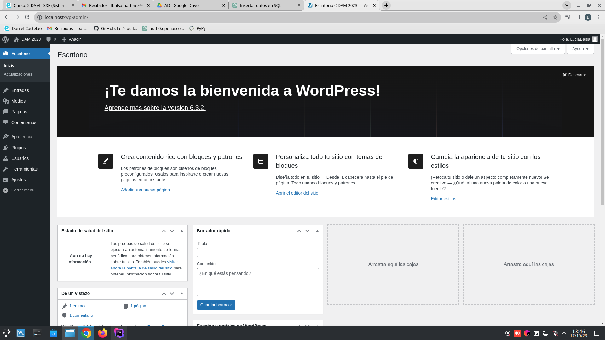

## PASOS PARA LEVANTAR WORDPRESS ##

**1. Buscar información de wordpress**<br>
Wordpress es un sistema de gestión de contenidos que permite crear y administrar
sitios web de manera fácil y sin conocimientos técnicos. Desde su lanzamiento, se ha convertido en la plataforma más popular para la
creación de sitios en línea. Gracias a su sistema sencillo e intuitivo, puedes crear desde un blog personal hasta
la web más compleja.

En la página Docker docs, podemos encontrar una [guía](https://docs.docker.com/samples/wordpress/) para levantar
un contenedor y poder ejecutar Wordpress con su respectiva configuración.

**2. Buscar imagen de Wordpress en DockerHub**<br>
Necesitamos la imagen de Wordpress para nuestro contenedor, la cual obtendremos de 
[DockerHub](https://hub.docker.com/_/wordpress).

**3. Crear docker-compose.yml**<br>
A continuación, debemos crear en nuestro proyecto un fichero llamado docker-compose.yml, en el cual escribiremos
la configuración necesaria para ejecutar Wordpress.<br>
Sería la siguiente:

```
services:
db:
# We use a mariadb image which supports both amd64 & arm64 architecture
image: mariadb:10.6.4-focal
# If you really want to use MySQL, uncomment the following line
#image: mysql:8.0.27
command: '--default-authentication-plugin=mysql_native_password'
volumes:
- db_data:/var/lib/mysql

    environment:
      - MYSQL_ROOT_PASSWORD=somewordpress
      - MYSQL_DATABASE=wordpress
      - MYSQL_USER=wordpress
      - MYSQL_PASSWORD=wordpress
    expose:
      - 3306
      - 33060
wordpress:
image: wordpress:latest
volumes:
- wp_data:/var/www/html
ports:
- 80:80

    environment:
      - WORDPRESS_DB_HOST=db
      - WORDPRESS_DB_USER=wordpress
      - WORDPRESS_DB_PASSWORD=wordpress
      - WORDPRESS_DB_NAME=wordpress
volumes:
db_data:
wp_data:
```
En este código podemos observar distintas partes:
- Usamos la base de datos MariaDB para almacenar la información. 
Establecemos usuario, contraseña, etc. 
La base de datos expone los puertos 3306 y 33060 para que otros servicios
puedan comunicarse con dicha base de datos.
- Por otra parte tenemos el servicio de Wordpress, que es la plataforma 
para crear y administrar un sitio web.
Utilizamos la imagen más reciente de Wordpress.
Wordpress hace que el sitio web sea accesible en el puerto 80 de
nuestro sistema, lo que significa que podemos ver el sitio web escribiendo
la dirección de nuestro servidor en un navegador web.
- Todos los datos que se generen, tanto de la base de datos como del sitio web,
se almacenan en sus correspondientes volúmenes.


Finalmente, lanzamos el comando `$ docker compose up -d`, para levantar el contenedor
y que empiece a funcionar.

Para comprobar su correcto funcionamiento, escribimos en el navegador nuestra dirección IP
seguida del puerto 80, es decir:

http://10.0.9.15:80 o bien http://10.0.9.15/wp-admin para que nos lleve
a la página de inicio de sesión.


